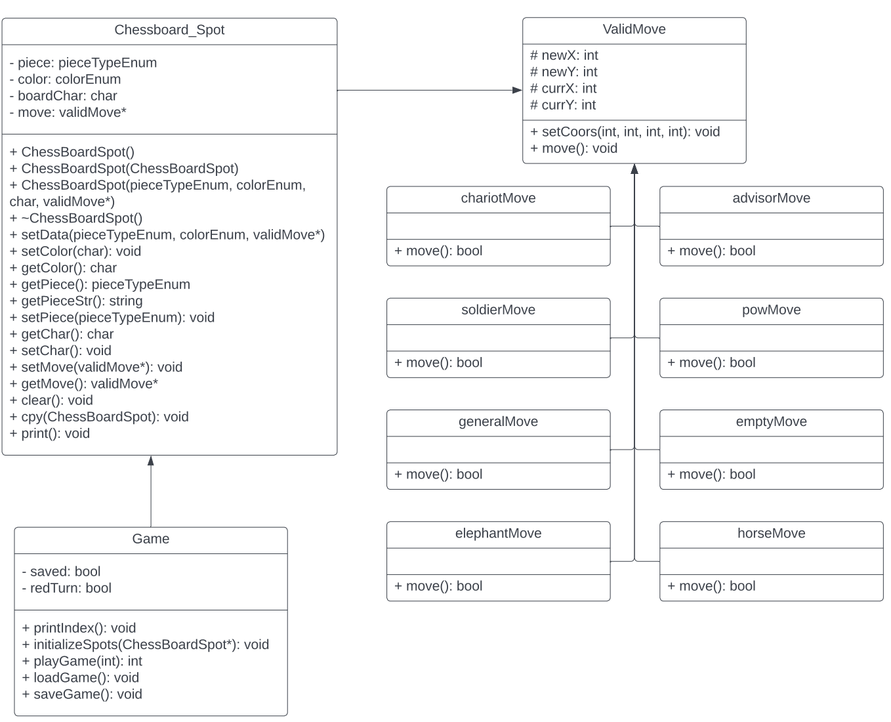

# Chinese Chess
 
 > Authors: [Ying-Jia(Samuel) Lin](https://github.com/SamuelLin213), [Will Huang](https://github.com/whuan126), [Jacqueline Gardea](https://github.com/jlgardea), [Dylan Talmood](https://github.com/dtalmood)
 
## Project Description
 > * The project is important and interesting to us, as it allows us to learn a new game and explore Chinese Chess using C++ implementation. Additionally, Chinese Chess provides a different perspective, in contrast to the traditional chess that most people are familiar with. There's a lot to consider when creating Chinese Chess, as opposed to traditional Chess. 
 > * At this moment, we plan to use C++ as the main language of the project, alongside the Linux terminal, which will provide the "front-end" aspect of the project.
 > * The project will prompt the user for the coordinates of the piece they wish to move, and the coordinates they wish to move the piece to. After every move, the terminal clears the screen and outputs an updated board. When a game is won, the program will stop prompting for piece selection and coordinate inputs, and will output a message indicating which team won. Additionally, the program will implement the function to load the game from data saved in a local .txt file. When the program first runs, it will prompt the user whether they would like to continue from a saved game or start a new game. Color-coded numbers on the terminal output, alongside a index at the side, will represent each Chess piece. 
 
## Class Diagram
 
 > * The Chessboard class represents the playing board and is composed of objects of the Chessboard Spot class. This class contains data members describing the occuptation status(piece and color) of each spot. Enums are used for the piece names and the player colors. Each spot has a member pointer to validMove, which determines which move() function to call. Empty spots have a nullptr.
> * The strategy design pattern occurs with the validMove class, which allows for the right variation of the move() function to be called. This allows checking that the selected piece follows the rules of Chinese Chess. 

## Design Pattern
 > * The strategy design pattern occurs with the piece class, which allows for the right variation of the validMove() function to be called, when checking that the next move is valid, according to the allowed movement for each piece. 
 > * We picked the strategy design pattern, as it allows us to choose which validMove() function is called for the piece class. This way, only specific rules are checked, when it comes to ensuring the next moves are valid. 
 > * The strategy design pattern allowed us to write better code, by separating the verification of the next move into different classes, and have the right variation of the function be called. 
 
 ## Screenshots
> * Users are greeted with menu and prompts upon running the program: <br />

> * Opening menu, from which users select to either start a new game, with pieces in their default positions, or load a saved game, using coordinates saved in a .txt file. 

> * Upon starting the game, users are prompted to enter the coordinates of the piece they wish to move. The color of the current turn is shown near the top, right below the piece index. 

> * If the user chooses an invalid coordinates(i.e. out-of-bound), an error message will be displayed, and they're prompted again to enter coordinates. A similar error message also appears for the prompting of the destination coordinates. 

> * If the user chooses a piece of the wrong color(i.e. player black selects a red piece), then the user will be prompted again to enter coordinates.

> * If the user chooses an empty spot, they'll be prompted again to enter coordinates. 

> * After the user selects a valid piece to move, they'll be asked to confirm the piece. Entering 'n' will run the initial prompt of asking for coordinates. Entering 'y' will lead to prompting of the destination coordinates. 

> * If the user enters destination coordinates that contain a piece of their own color, an error message will appear, and they'll be prompted again to enter new destination coordinates. 

> * Once one of the player's general pieces has been capture, a winning message will be displayed, which indicates which player won.

 ## Installation/Usage
 > This Chinese Chess program runs on a Linux terminal. In order to run the program. Execute the following commands in the terminal:
 > ```
 > cmake3 .
 > make
 > ./game
 > ```
 > The program is entirely text-based and runs directly from the terminal.
 ## Testing
 > Our project was tested and validated via the Google gtest submodule. Through units tests written using mock classes of each piece class, the validity of each piece's move() function was tested to ensure each piece follows Chinese Chess rules. 
 > Each piece was tested with both black and red pieces, as well as edge-cases. 
 
